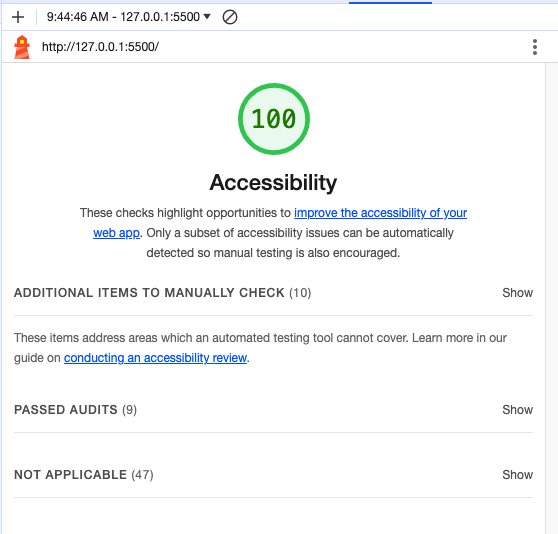

# odd-duck

## Application Overview

### The Client Request

Odd Duck Product Co is trying to decide which project from their R&D department they should invest in next to sell. They asked you to make a web page that they can run at a kiosk at the front entrance of their campus. Whenever an employee walks by, the employee can vote for 1 of the 3 products displayed that they think should be the next new product brought to market. After a week of collecting data, they would like some nice graphs to visualize the results.

To make this data collection project maximally effective, Odd Duck wants you to build an app that displays three potential products side-by-side-by-side, without favoring any single product. You’ll need to manage the size and the aspect ratio of the images.

As the app’s purpose is to have the staff members choose which product, of the three displayed images, that they would be most interested in seeing as a new creation, you will need to store each anonymous vote, calculate totals, and visually display the results.

To keep the product selection process as untainted as possible, you have been instructed to not allow any results to be shown to users until there have been a total of 25 selections made.

The marketing team is not only interested in the total number of clicks, but also the percentage of times that an item was clicked when it was shown. So, you’ll also need to keep track of how many times each image is displayed and do the calculations.

### The Design

- The page was designed with simplicity in mind. The primary focus being the images displayed in the center. Simple instructions and explanation given at the top so employees could understand what to do with a glance. 

- Each image has a hover state so the user knows which image they are choosing.

- A simple large button placed below the images will give results once all 25 choices have been made. 

- The chart was designed to stand out against the dark background and hover states allow for easy recognition of results by the changing of colors on each bar. Results are displayed showing the number of votes and number of views for each image. 

### The Code

- A constructor function creates an object associated with each product, and has the following properties:
      - Name of the product
      - File path of image
      - Times the image has been shown
      - Number of clicks

- An algorithm was created that randomly generates three unique product images from the images directory and displays them side-by-side-by-side in the browser window. The products are not duplicates from the immediate previous set.

- Using ChartJS, a canvas element was used to store the chart which displays all the data from the user clicks.

- The data was stored in local storage using JSON.

- Lighthouse utility used to check accessibility and all items fixed to give a 100% Accessibility score.

### Lighthouse Reports

